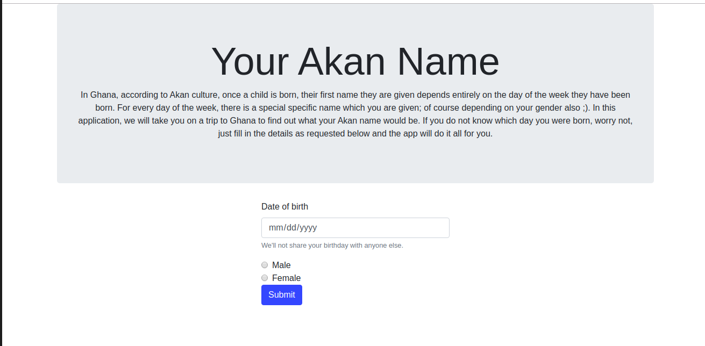

# Project Akan Name
### Description
This web application takes in a user's date of birth and gender,and through an algorithm determines which day of the week the user was born. with this determination, the app is then able to let the user know what their name in Akan would be. In Akan culture, a child is named after depending on the day of week they were born. The app determines based on the fed in criteria which name the user would have.
## Site
Link to site https://mogere.github.io/akan-name

### BDD
User is required to enter their date of birth
User selects their gender
user submits their entries on the form
site gives an alert box with the user's akan name

### Landing page

### Technologies used 
* HTML
* CSS 
* Github (for hosting)
### setup
Being a basic website with no intricate technologies, you need basic text editor to edit the code, and have git installed on your machine. 

## Want to propose any changes?
- Fork repository
- Create new branch
- Make the proposal
- commit the changes with appropriate message on changes and push
- Create a pull request

## copyright 
MIT 
Copyright © Philip Nyatichi.